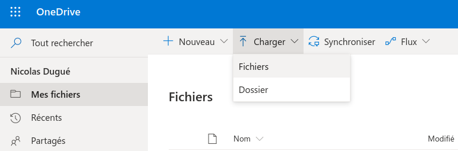
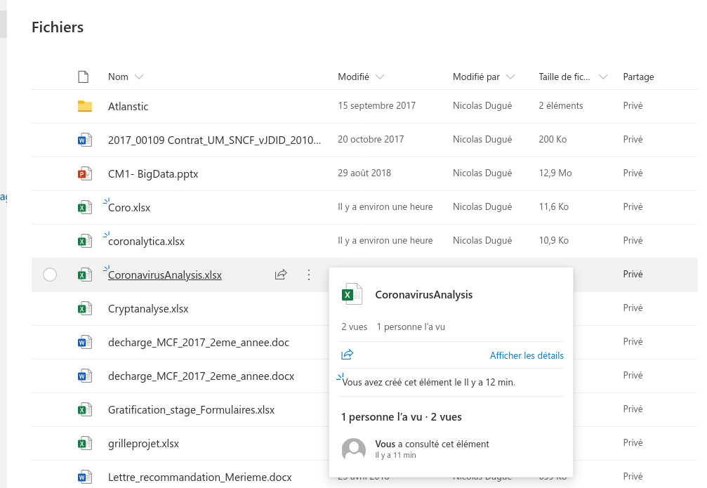
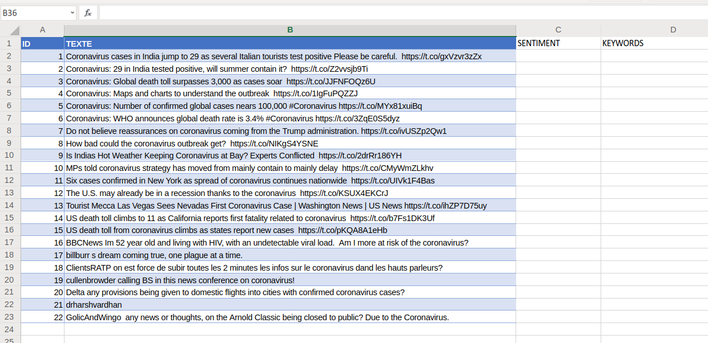
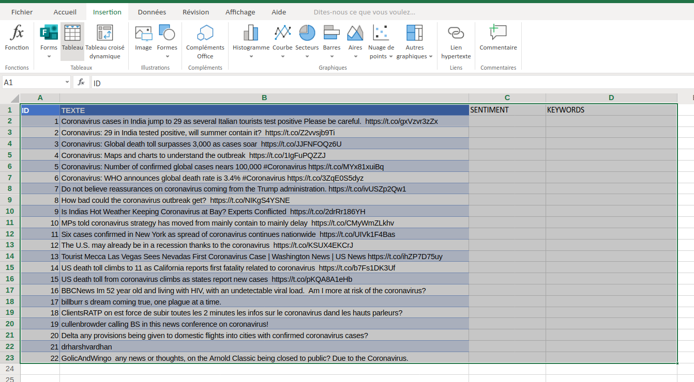
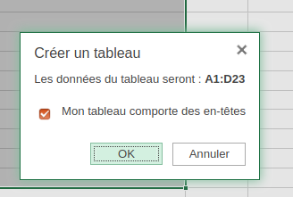
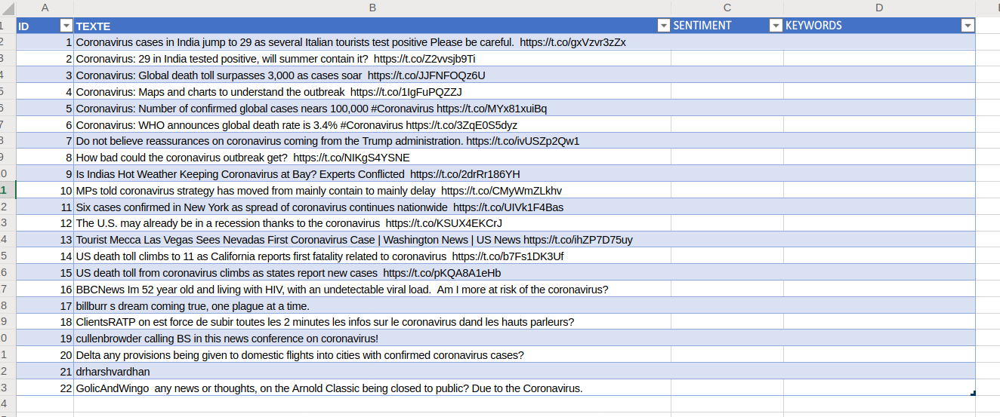

# Traitement automatique de la langue naturelle

Dans ce tutoriel, l’objectif est d’utiliser les outils d’analyse de texte proposés par Microsoft via leur outil Azure. Il est possible d’accéder à ce service en créant un compte étudiant sur Microsoft Azure, qui vous permet d’obtenir 100$ de traitements informatiques gratuits. En particulier, nous allons analyser l’opinion (ou sentiment) exprimée dans un tweet : il s’agit de savoir si un tweet est plutôt positif ou négatif.

Pour simplifier l’utilisation de Microsoft Azure et rendre l’outil accessible aux non-informaticiens (aux gens qui ne programment pas), Microsoft propose le service Power Automate, sur lequel il faut également vous connecter pour ce tutoriel.
Enfin, pour analyser les données que vous souhaitez traiter, il s’agit de les organider sous forme de fichier Excel et des les stocker en ligne sur l’espace OneDrive de Microsoft.

Il faut donc être connecté aux services : [Onedrive](https://onedrive.live.com/), Power Automate et [Azure](https://portal.azure.com/).

## Étape 1 : Mettre votre fichier en ligne sur OneDrive et le formater pour l’utilisation par Azure

Tout d’abord, il faut déposer votre fichier Excel sur OneDrive !

Une fois que celui-ci est déposé sur OneDrive, il apparaît dans la liste, comme ici mon fichier *CoronavirusAnalysis*. Il faut donc l’ouvrir !

Mon fichier ressemble au fichier ci-dessous. Nous avons une colonne ID qui identifie tous nos tweets de la seconde colonne. La troisième colonne sera remplie avec le résultat de l'analyse de sentiment réalisée par Azure.

Pour que Azure comprenne sur quelles données il doit travail, nous sélectionnons tout le tableau comme ci-dessous, puis nous utilisons *Insertion > Tableau*

La fenêtre ci-dessous s'ouvre, nous validons !

La mise en forme du fichier change, et dans les [plages nommées](https://support.office.com/fr-fr/article/utiliser-le-gestionnaire-de-noms-dans-excel-4d8c4c2b-9f7d-44e3-a3b4-9f61bd5c64e4), on voit l'apparition du tableau !

# Étape2 : Créer le service Azure
