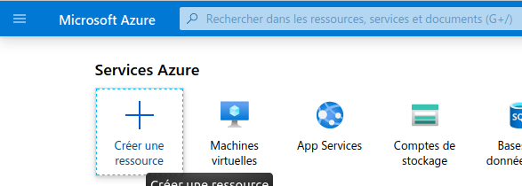
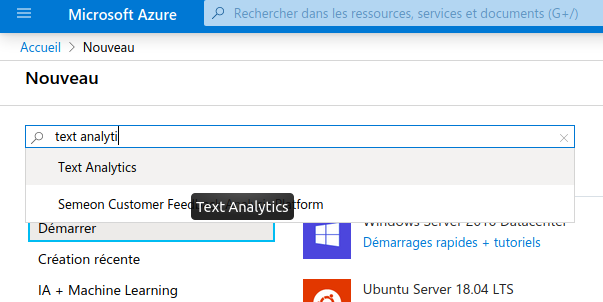
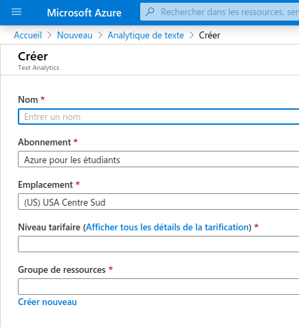
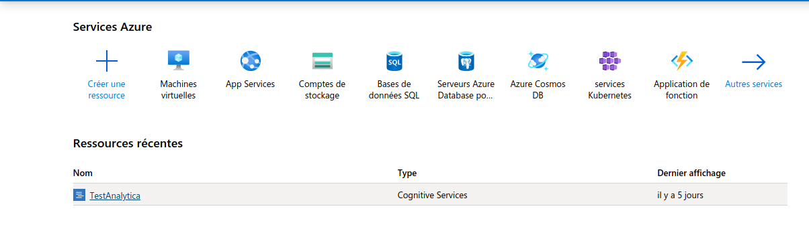
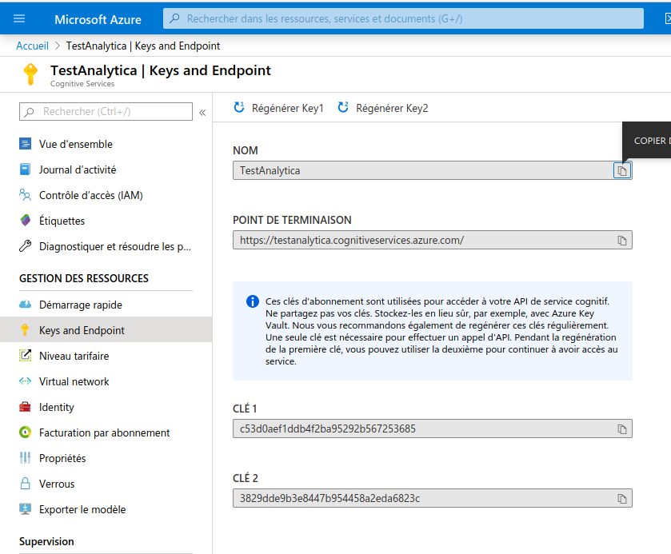
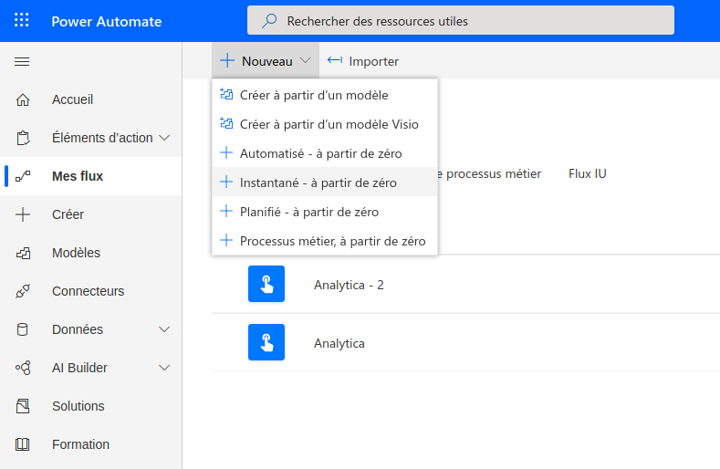
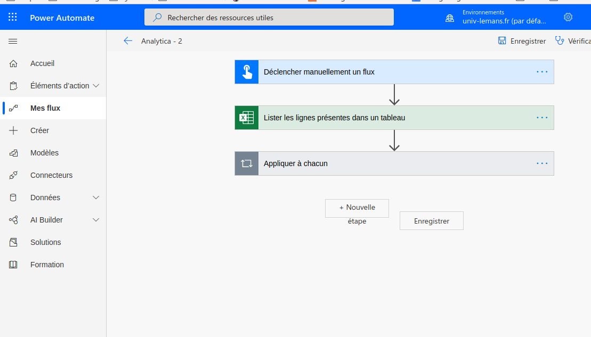
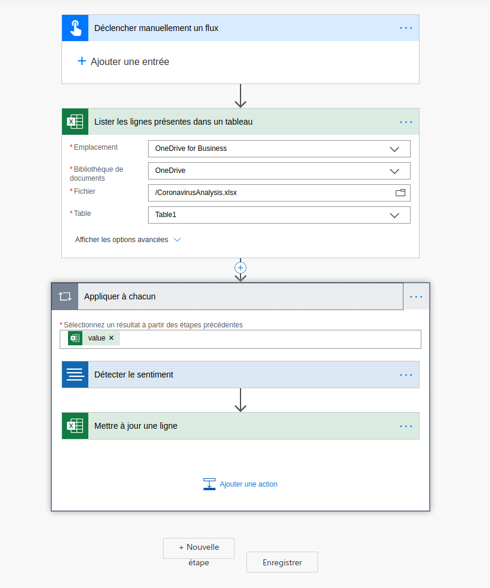
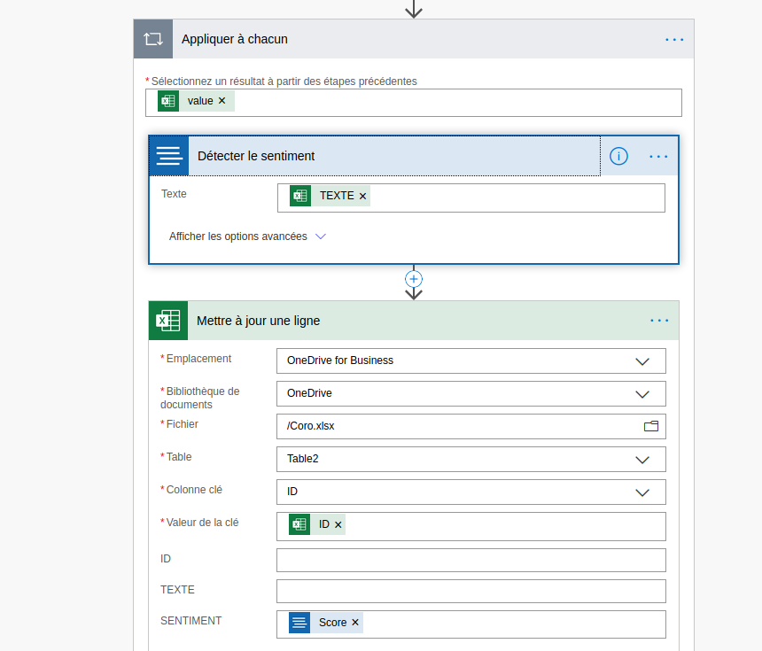

# Traitement automatique de la langue naturelle

Dans ce tutoriel, l’objectif est d’utiliser les outils d’analyse de texte proposés par Microsoft via leur outil Azure. Il est possible d’accéder à ce service en créant un compte étudiant sur Microsoft Azure, qui vous permet d’obtenir 100$ de traitements informatiques gratuits. En particulier, nous allons analyser l’opinion (ou sentiment) exprimée dans un tweet : il s’agit de savoir si un tweet est plutôt positif ou négatif.

Pour simplifier l’utilisation de Microsoft Azure et rendre l’outil accessible aux non-informaticiens (aux gens qui ne programment pas), Microsoft propose le service Power Automate, sur lequel il faut également vous connecter pour ce tutoriel.
Enfin, pour analyser les données que vous souhaitez traiter, il s’agit de les organider sous forme de fichier Excel et des les stocker en ligne sur l’espace OneDrive de Microsoft.

Il faut donc être connecté aux services : [Onedrive](https://onedrive.live.com/), [Power Automate](https://emea.flow.microsoft.com/fr-fr/) et [Azure](https://portal.azure.com/).

## Étape 1 : Mettre votre fichier en ligne sur OneDrive et le formater pour l’utilisation par Azure

Tout d’abord, il faut déposer votre fichier Excel sur OneDrive ! C'est dans ce fichier que seront stockées les données à traiter, mais également les résultats de l'analyse de sentiment.

Une fois que celui-ci est déposé sur OneDrive, il apparaît dans la liste, comme ici mon fichier *CoronavirusAnalysis*. Il faut donc l’ouvrir !

Mon fichier ressemble au fichier ci-dessous. Nous avons une colonne ID qui identifie tous nos tweets de la seconde colonne. La troisième colonne sera remplie avec le résultat de l'analyse de sentiment réalisée par Azure.

Pour que Azure comprenne sur quelles données il doit travail, nous sélectionnons tout le tableau comme ci-dessous, puis nous utilisons *Insertion > Tableau*

La fenêtre ci-dessous s'ouvre, nous validons !

La mise en forme du fichier change, et dans les [plages nommées](https://support.office.com/fr-fr/article/utiliser-le-gestionnaire-de-noms-dans-excel-4d8c4c2b-9f7d-44e3-a3b4-9f61bd5c64e4), on voit l'apparition du tableau !

# Étape2 : Créer le service Azure

Sur Microsoft Azure, créer une ressource !

Créer cette ressource en tant que Text Analytics : c'est ce type de ressources qui permet de faire l'analyse de sentiments.

Entrer un nom (dans mon cas *TestAnalytica*), choisir l'emplacement en Europe, le niveau tarifaire le plus faible, et créer un groupe de ressources pour l'occasion.

Ci-dessous, je trouve ma ressource *TestAnalytica* que je viens de créer et je l'ouvre

Sur ma ressource, je choisis de trouver les keys and endpoint, et je note le point de terminaison et la clé. Ces informations, c'est ce qui va permettra à Power Automate d'appeler notre service *TestAnalytica* Azure pour analyser le texte stocké sur OneDrive.

# Étape 3 : la configuration Power automate

L'objectif ici est de créer un flux tel que Power Automate va aller chercher nos données dans OneDrive, les traiter et mettre à jour les données avec les résultats.

On commence donc par créer un flux.

Ce flux sera composé de trois étapes et déclenché manuellement (une fois sur tous les tweets qu'on souhaite analyser).
Pour ajouter une étape, on clique sur nouvelle étape.

Les étapes sont : 
- déclenchement manuel
- récupération des données dans le tableaux Excel
- Application des résultats

L'étape 2 est plus détaillée dans la figure qui suit. On choisit l'emplacement de notee fichier : OneDrive. Puis on choisit le fichier, et le tableau que nous avons créé au sein de ce fichier.

La dernière étape est détaillée dans la figure qui suit. On récupère *value* les données de l'étape 2, et on applique la détection de sentiment sur la colonne *TEXTE* du document Excel stocké sur OneDrive.
Puis on met à jour les lignes du même document, en prenant pour clé la colonne *ID* de notre document qui identifie chacun de nos tweets, et en insérant le *Score* résultant de l'analyse de sentiment dans la colonne *SENTIMENT* de notre document.

Il n'y a plus qu'à tester !

